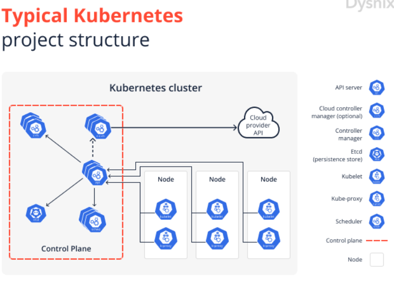
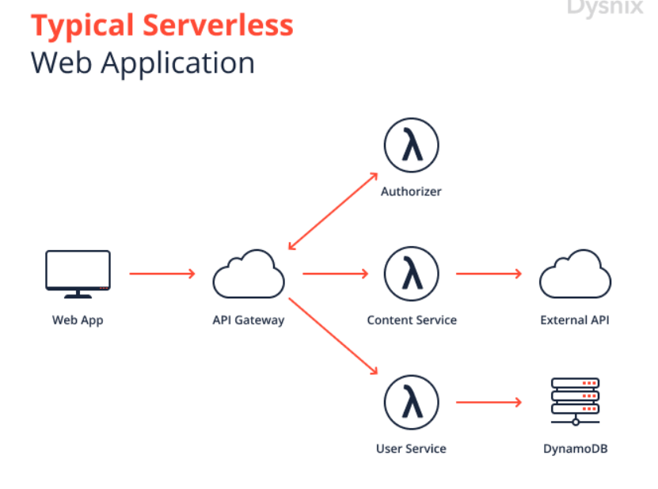
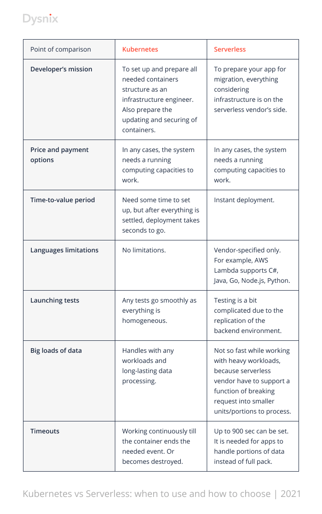

# Домашнее задание к занятию "Микросервисы: масштабирование"

Вы работаете в крупной компанию, которая строит систему на основе микросервисной архитектуры.
Вам как DevOps специалисту необходимо выдвинуть предложение по организации инфраструктуры, для разработки и эксплуатации.

## Задача 1: Кластеризация

Предложите решение для обеспечения развертывания, запуска и управления приложениями.
Решение может состоять из одного или нескольких программных продуктов и должно описывать способы и принципы их взаимодействия.

Решение должно соответствовать следующим требованиям:
- Поддержка контейнеров;
- Обеспечивать обнаружение сервисов и маршрутизацию запросов;
- Обеспечивать возможность горизонтального масштабирования;
- Обеспечивать возможность автоматического масштабирования;
- Обеспечивать явное разделение ресурсов доступных извне и внутри системы;
- Обеспечивать возможность конфигурировать приложения с помощью переменных среды, в том числе с возможностью безопасного хранения чувствительных данных таких как пароли, ключи доступа, ключи шифрования и т.п.

Обоснуйте свой выбор.
```
Тут вопрос такой, как масштабировать на арендованном железе (за счет увеличения железа), либо облачный сервис 
организовывать. Очевидно, если арендовать железо, то брать настройку системы нужно будет на себя. 
То есть самостоятельно управлять выделением нодов, слелди за загрузкой. Тут ключевой вопрос, насколько сильно 
меняются сервисы в размерах, то есть объемы относительно стабильны исходя из процессов или какой нибудь стартапа и требуется
доволно координально масштабировать ресурс, а объемы например записят от подписчиков, количество которых сильно меняется.
Если стабильные объемы, то можно взять на себя настройку всей сервисной остнастки по принципу, если требуется простой вариант
Docker Swarm, масштабный Kebernetes. А если придется существенно масштабировать, то тогда желательно ориентироваться
на облачные структуры, с функциями автоматического выделения ресурсов, сфокусировавшись в первую очередь на функционале 
микросервисов.
Исходя из того, что не обозначена критичность в существенных изменениях ресурсов, исходя из универсальности, я бы выбрал Kubernetes на арендованном железе и дополнительный софт для хранения и шифрования чувствительных данных, например, Vault с автоматической заменой, например, токенов 
раз в 12 часов в замен хранения паролей и т.д.
```
Требование|Docker Swarm|Kubernetes|Yandex Serverless Containers (wo Kubernetes)|Amazon Container Service|Azure Contaner  Service
---|---|---|---|---|---
Контейнеризация|+|+|+|+|+
Маршрутизация|+|+|+|+|+
Горизонтальное масштабирования|+|+|+|+|+
Автоматическое масштабирование|+|-|+|+|+
Разделение ресурсов|+|-+|+|+|+
Конфигурирование|+|+|+|+|+

https://dysnix.com/blog/kubernetes-vs-serverless-part-1



## Задача 2: Распределенный кэш * (необязательная)

Разработчикам вашей компании понадобился распределенный кэш для организации хранения временной информации по сессиям пользователей.
Вам необходимо построить Redis Cluster состоящий из трех шард с тремя репликами.

### Схема:


---

### Как оформить ДЗ?

Выполненное домашнее задание пришлите ссылкой на .md-файл в вашем репозитории.

---
